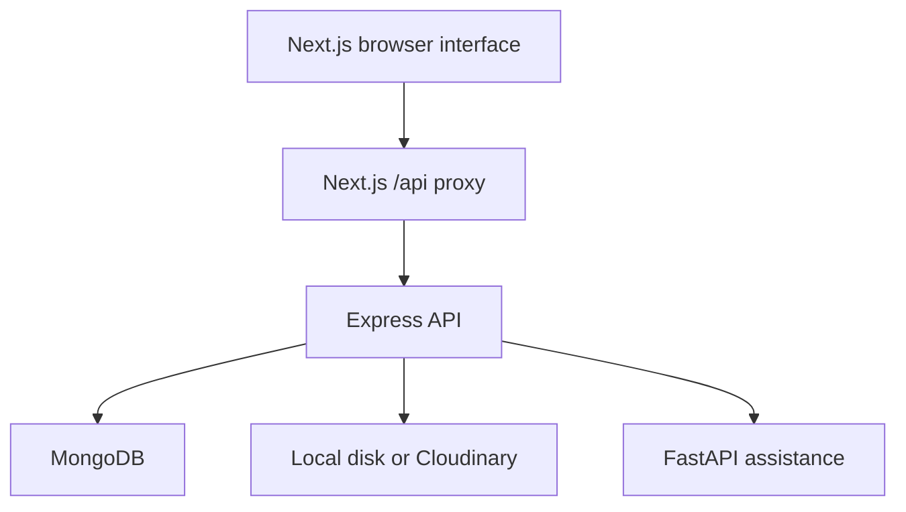

# Architecture

The `/demo` page runs entirely in browser memory with fictional examples. It does not call the rescue API or persist changes across refreshes.

## Service boundaries

| Service | Responsibility | Local port |
| --- | --- | --- |
| frontend | Next.js App Router, public and role-based screens, same-origin proxy | 3000 |
| backend | JWT authentication, report creation, history, summaries, case details | 5000 |
| ai_service | Experimental severity prediction, duplicate checks, first-aid response | 8000 |

Key implemented routes: `POST /api/auth/register`, `POST /api/auth/login`, `POST /api/auth/admin-login`, `GET /api/auth/me`, `POST /api/rescue/report`, `GET /api/rescue/user/history`, `GET /api/rescue/user/summary`, and `GET /api/rescue/:id`.

Report creation calls `/severity/predict`, `/duplicate/check`, and `/firstaid/help` on the Python service. Each call has a timeout, and failures are handled independently. The severity model is loaded from the existing repository artifact; no reliability claim is made.

## Known limitations

NGO and admin pages are not evidence of complete server-side workflows. Complete assignment/status endpoints, verified organization onboarding, and operational notifications remain future work. Public NGO registration currently does not verify organizations. First-aid output is not veterinary advice. Duplicate detection must be evaluated for concurrency and persistence behavior before production use.

JWTs are currently kept in localStorage. A production deployment should review session design and adopt secure cookie handling with appropriate CSRF defenses. Upload validation currently relies on MIME metadata and size limits; content inspection and abuse controls need further work. Local uploads need persistent storage when deployed.

## Deployment

Deploy the frontend with `BACKEND_API_URL` pointing to the backend's `/api` base. Browser API traffic defaults to the same-origin proxy. Set `AI_SERVICE_URL`, `MONGO_URI`, and `JWT_SECRET` on the backend. Keep credentials out of source control. Configure backend CORS for any clients calling it directly. All services need HTTPS in production.

Generated dependencies, Python caches, and local environment files are excluded from new commits. Removing tracked environment files does not erase old Git history: rotate any real credentials that were previously committed.
